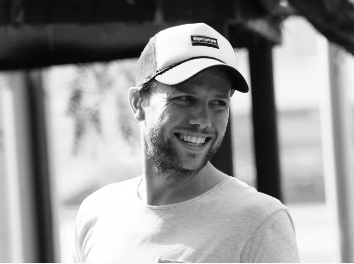

<Seo
  title="About"
  description="I’m Richard Simms a user experience designer,I increase confidence in assumptions to create better experiences to make amazing digital products."
/>

import { RoughNotation } from "react-rough-notation"
import { Fragment } from "react"
import { Button } from "theme-ui"
import { darken } from "@theme-ui/color"

## My mission is to make <Fragment><RoughNotation type="underline" show={true}  strokeWidth={2}>people’s experience</RoughNotation></Fragment> the measure of quality – that delivers business value.

Hi! I’m Richard, I’m a long-time product designer who is passionate about taking new ideas from 0 to 1 and helping others make great [career decisions](https://www.seek.com.au/career-advice/) at [SEEK](https://www.seek.com.au). Before that, I led the design practice at [Open Universities Australia](http://open.edu.au/), designed [native mobile apps](https://www.suncorp.com.au/banking/help-support/ways-to-bank/suncorp-app.html?intcmp=SUN:GI:PI:NPS:OSL:20180729:2911) for Suncorp bank, and led experience design for a leading London creative agency.

I’m excited to collaborate with a multi-disciplined of experts on ideas, shipping and continuously iterating new product and features that address the needs of users. 

[Continuous discovery habits](https://www.producttalk.org/2021/05/continuous-discovery-habits/) form the foundation and informs my work. As a great active listener and critical thinker, my research practice evolves around asking open ended and specific questions to unearth critical information. I love nothing more than to co-designing with customers to identify and solve their most difficult problems.

Through prototyping and [testing business ideas](https://www.strategyzer.com/books/testing-business-ideas-david-j-bland), I increase confidence, move closer to our outcomes and create better experiences that people are willing to change their behaviour for.

On the side, I built a not-for-profit marketplace for volunteers to make scrubs (uniforms) for [healthcare heroes](/ronascrubs/) in response to COVID-19 in Australia. Recently I began [writing](http://uxmba.substack.com/) about leadership, management, and career advice to UX and product professionals.

If you have additional questions, you can <a href="mailto:&#x72;&#x69;&#x63;&#x68;&#x61;&#x72;&#x64;@&#x72;&#x73;&#x69;&#x6d;&#x6d;&#x73;.&#x63;&#x6f;&#x6d;">email me</a> directly.

When I’m not in front of a screen, you can find [me on a bike](https://www.strava.com/athletes/12283677), riding through the Australian bush or at least finding my Zen on Beach Road, Melbourne, AU.

[<Button mr={1}>View happenings</Button>](https://poly.work/richardsimms)

| Career history |
| :--- | ----: | :---- |
| [**SEEK**](https://seek.com.au)    | UX Designer      | `2021—`  |
| [**UXMBA**](http://uxmba.net)    | Author          | `2021—` |
| [**Open Universities Australia**](https://open.edu.au)    | UX Designer      | `2019—2021`  |
| [**Rona Scrubs**](/ronascrubs)    | Customer Experience       | `2020`  |
| [**Outware Mobile / ARQ**](https://arq.group/)    | UX Designer      | `2017—2019`  |
| [**SapientRazorfish**](https://www.publicissapient.com/)    | UX Designer      | `2015—2017`  |
| [**WAE, a Globant company**](https://www.globant.com)    | UX Designer      | `2014—2015`  |
| [**ORM**](https://ormdigital.com)    | Senior Interaction Designer      | `2013—2014`  |
| [**RT Software**](https://rtsw.co.uk)    | Senior Designer      | `2007—2013`  |
