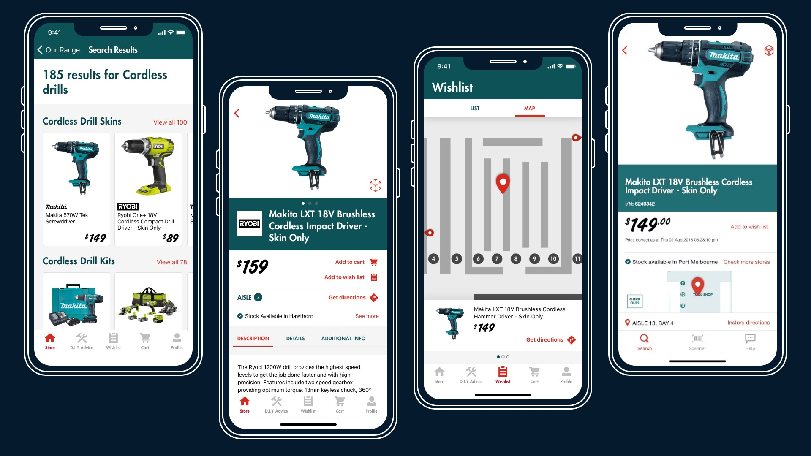

# Redefining the way Australian’s shop for home improvements.
Create and validate a concept for a Bunnings mobile app. By exploring the  technical feasibility and practical application of several technologies to support the customer in their pre-shop, in-shop and post-shop experience 

<Vimeo vimeoId="716665195" />

## What we did for Bunnings Warehouse
In June 2018. Bunnings wanted help to understand if building a mobile application, would complement their in-store and website experience to make the lives of their customers better, by supporting them through their home improvement journey.

To validate the key pain points and needs of Bunnings customers that could be solved through a mobile app.
We explored ways to inspire and improve awareness of Bunnings products; to help customers learn, to and share their D.I.Y. experiences. We explored the technical feasibility and practical application of several technologies.

Furthermore, we wanted to provide people who were engaged in home renovation, personal D.I.Y. projects or restyling their home & garden; a practical place to find constructive advice and the equipment needed to complete their task. 

We wanted to improve the in-store shopping and D.I.Y. experience of Bunnings Warehouse. Their customers would often feel lost and overwhelmed at the size of the stores, especially when visiting a new store or searching for a single product. Reviewing the in-store customer experience, we understood that:
- _Finding a product in-store_ was the most frequent problem and took up a large amount of time for staff members. 
- _Learning new D.I.Y. skills_ is the second most frequent problem. People were not aware that there are in-store classes or that Bunnings has a large catalogue of video content. 
- _Product selection_ cause difficulties for both shopping and DIY experiences, staff members are experts to solve this in-store if we could free up their time from helping people find products. Better digital product descriptions and information was needed. 

### Our Approach
To create cohesive, complete experiences that will resonate with customers. That deliver each experience incrementally to continuously unlock value for Bunnings and their customers.

We spoke with **30 stakeholders** across Bunnings Warehouse, The Branding Agency and AKQA, generating product opportunities for how a mobile app would support the customer experience in the near future.

We identified key moments where we would support the customer across their pre-shop, shop and post-shop journey’s. From these key moments, we prepared a list for a proof of concept. The rest of ideas were broken into phase of: now, next and later features roadmap for exploration.

| Key themes |
| :--- | :---- | :---- |
| **Pre-shop** | **Shop** | **Post-shop**|
| Wishlist | Bunnings Wallet | Workshop Integration |
| AR Project Visualisation | In-store Assist | Partnerships |
| Video Hub |  Find a Team Member | Delivery| 
| Project Assistant | Self Checkout / Bunnings Go | Post-product support & help | 

## Product strategy
The 'Now, Next, Later' prioritised opportunities became our foundation. Starting in the 'Now' swim-lane. We broke-down each opportunity into multiple assumptions that were prioritised, then story mapped and categorised into Desirability, Viability, and Feasibility assumptions to test. 

### Bridging the online-offline retail gap
Support customers through their online research and later in-store purchases. In 2018, mobile commerce traffic drives over 50% of e-commerce in developed countries, and it was predicted that the rest of the world would follow suit. With app usage taking up 90% of all mobile uptime. More than the entire browser-based internet as a whole. 

In-store mode significantly increases retail app engagement levels. With the segment growing from 17 percent to 30 percent of total users, with the number of users increasing 14 times throughout 2017.

Through the blue ocean strategy framework, we were able to identify gaps in the customer experience that a mobile application could have the potential to win. Where the website is less supportive in the Shopping journey and transaction stage. The mobile application could create value by helping customers easily find their nearest store, be confident that products were available, and quickly find the products they desired. Using SWOT we could further improve our assumption map and de-risk the possible solution. 

|  |
|:--:|
| <b>Image Credits - Sketch by [Alex Zhadan](https://alex-zh.com/)</b>|

#### Design studio
We kicked off the design and validation phase by running a design workshop with the stakeholders from Bunnings, AKQA and a few of our creative types.
In which we reviewed the customer needs and pains; mapped to different buyers persona stage of the customer journey. We sketched key aspects of the experience, to communicate the value and to quickly iterate ideas. 
We then built a prototype that reinforced D.I.Y. is fun and inspiring customers through a digital ecosystem to complete their projects.

#### Easily manage any D.I.Y. project.
**Making the home improvement journey seamless and enjoyable, by supporting customers in getting their big plans done.**
Creating a place for the research, thinking and planning behind the customer's next great project. 
Keep hold of those receipts. Customers can import receipts from the store by simply taking a picture of it. View and share them instantly. 
D.I.Y. advice section to search & find tutorials, videos, ideas, activities, and inspiration for D.I.Y. projects around the home and garden.

#### Locate all products quickly and learn new D.I.Y. skills.
**Reinforcing D.I.Y. is fun and inspiring customers through a handy digital ecosystem to complete small jobs and projects.**
Source the location of any product, allowing for a more enhanced shopping experience.  Remove the friction and anxiety of finding a product in store.
Receive all the information needed to get a D.I.Y. project off to a good start. Browse and register for upcoming events at a local Bunnings store.

#### Enhanced mobile shopping experience.
A shopping experience users are familiar with, allowing customers an easy way to purchase any product, any time, any day.  
Add, remove, adjust and change your items in the shopping cart as much as you need. Use a simple checkout and payment process once ready. 
Make use of a simple payment process as well as keeping track of your in-app purchases with a digital receipt. 

#### Customer research
We interviewed customers throughout the process to understand customers needs and identify features that would trigger user engagement with the app. We also spoke to customers in-store guerrilla style field research and lab-based research to validate the potential solutions, discoverability, and desirability.
1. Learnt about their problems and needs 
2. Gather usability feedback
3. Overall product suitability and fit

### Proof of concept features to support the key experiences
#### Voice & text chatbot
Support conversations with a customer to locate the product (link to wayfinding) and provide support in choosing a product (i.e. cordless drills).
-  If you need help to find a product, ask “Where are the drills?”
- Or if you need help choosing a product, ask “Bosch drills”

Added some simple conversations with a customer to Locate the Product (link to wayfinding) and provide support in selecting a product (i.e. cordless drills).

#### In-store mode
As the customer arrives near a Bunnings Warehouse, the mobile app welcomes them with a notification.
Opening the app gives the customer a unique experience, with personalised and relevant content to make their visit more convenient and products easier to find.

- The in-store mode acts as an overlay over the app. It’s accessible via a button that appears in the app when the user is near the store, or directly through the push notification.
- Easily accessible three key actions: Get Help, Scan Product/Barcode and Store Map. 
- Relevant store information is easy to find and introduces the convenient ability to self serve. 
- Focusing on the personalised shopping Wishlist with aisle and bay location.
- Tab access to see What’s On in the store, and user’s past receipts.
- Search results are prioritised by products currently in-stock at that store across the range.

#### Product detail
The product details, hero the product imagery, allowing for a multiple image and access to view the AR product visualisation.
Utilising the power of the mobile, the primary actions and information is docked at the top of the screen as the details become visible. 

- Focus on product, creating visual interest and allowing the users to play with the interface, creating delight. 
- Key actions called out up front: Add To Wishlist and Add To Cart. These then dock to scroll for easy access.
- Access to view the AR product visualisation through the iOS 12 AR Quick Look icon (top right).
- Product reviews, descriptions, and other details easily accessible on swipe up. 
<Vimeo vimeoId="716686759" />

#### AR product view
See it before you buy it. AR product visualisation lets you imagine how products will look and feel, before going to store. Display a 3D representation of a product that the user can then place on a surface e.g. floor, table and interact with.

For those products in the catalogue that have a 3D model, the 3D visualisation feature is enabled and once accessed from the product detail screen. With ARKit and SceneKit, the app tries to detect a plane to place the model onto. The customer can then move and rotate the product. 

<Vimeo vimeoId="716750038" />

#### AR product wayfinding
Product wayfinding allows customers to answer the common question of “where is this item?” themselves. After searching and then viewing a product's details, the customer is presented with a navigation view. Once customers scan an aisle sign to allow the app to orientate, a virtual path is laid out for them, guiding them to the exact in-store product location. The solution makes use of Apple’s iOS framework ARKit and Outware developed indoor navigation technology.

#### Interactive store map
Working in tandem with AR Product Wayfinding, the interactive store map shows and tracks your current location, the path to the selected product and the destination. In addition to directions from A to B, the interactive map allows customers to explore the store by panning and zooming in on areas of interest.
Again using Apple’s iOS framework ARKit and Outware developed indoor navigation technology, the store map allows customers to see at little more than a glance where they are and how to get to the products they want.

#### Product image search
We collected image datasets for 14 classes of typical Bunnings products and trained an image classification model. We used the open source image-net database for computer vision research and used Apple’s TuriCreate machine learning framework to train the model and Apple’s native CoreML API to deploy the model locally in the app.

<Vimeo vimeoId="716751588" />

#### Barcode scanning
Incorporated a barcode scanning library in the mobile app, which can scan the barcodes and perform an API call (to the mock backend server) to retrieve the product details for this specific product.

## Summary
We were able to identify and test a range of solutions for Bunnings to help improve their customers have with the current experince.  